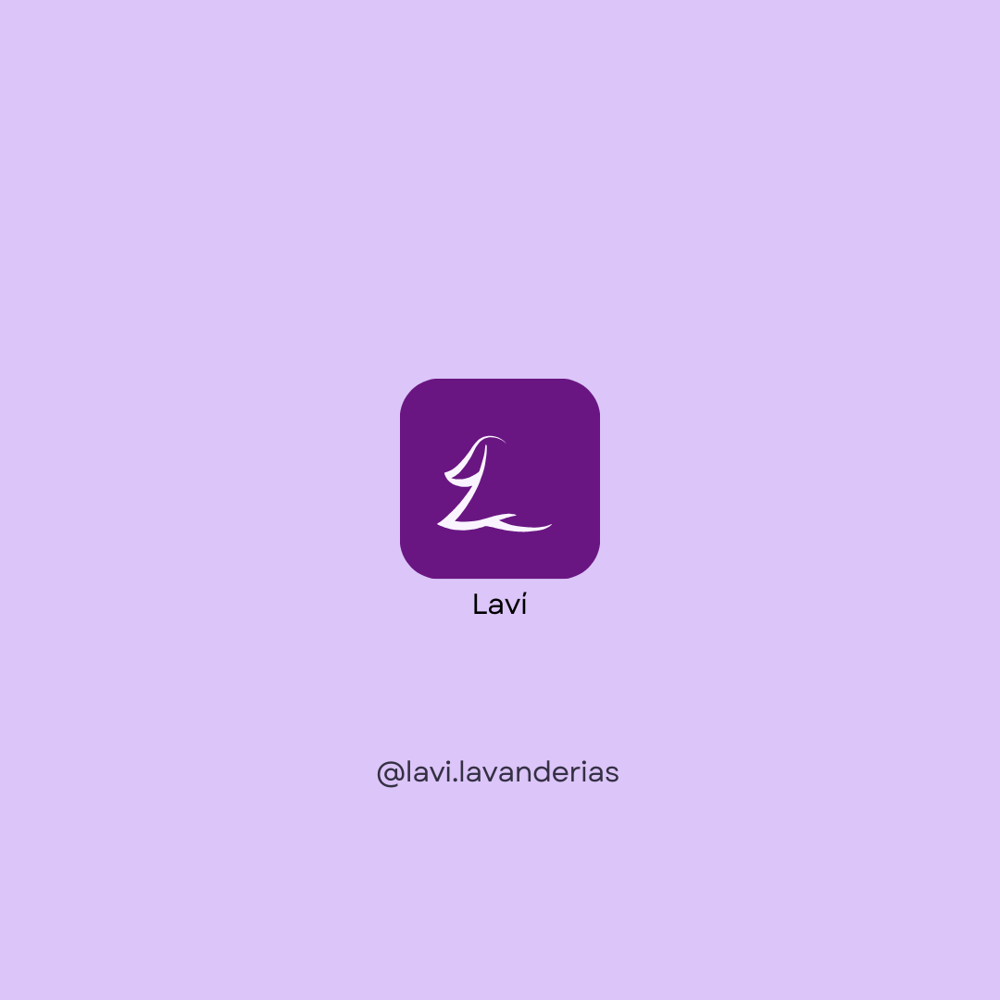

# Laví: o melhor aplicativo para lavanderias!

  

## Sobre o Projeto

Laví é uma solução tecnológica em formato de aplicativo móvel projetada para otimizar a conexão entre clientes e lavanderias. O projeto foi desenvolvido como um Trabalho de Conclusão de Curso (TCC) para o curso Técnico em Desenvolvimento de Sistemas da ETEC de Taboão da Serra.

A plataforma busca resolver problemas comuns no setor de lavanderias, como a dificuldade no gerenciamento de pedidos, a falta de comunicação eficiente com os clientes e a dificuldade de encontrar serviços especializados. Para isso, o Laví oferece funcionalidades tanto para os clientes quanto para os prestadores de serviço, centralizando a busca, o agendamento e a gestão dos serviços de lavanderia.

### Proposta de Valor

- **Para Clientes:** Facilitar a localização de lavanderias próximas, oferecer transparência no acompanhamento dos pedidos, e proporcionar um canal de comunicação direto com os prestadores de serviço.
- **Para Lavanderias:** Oferecer uma ferramenta de gerenciamento de pedidos, otimizar a comunicação com os clientes, e aumentar a visibilidade do negócio.

## ✨ Funcionalidades

O aplicativo Laví conta com uma série de funcionalidades pensadas para atender às necessidades de clientes e lavanderias:

### Para Clientes:
- **Localização de Lavanderias:** Encontre lavanderias próximas a você com a ajuda de um mapa interativo.
- **Busca Avançada:** Pesquise por lavanderias específicas pelo nome.
- **Agendamento de Pedidos:** Agende a coleta e a entrega de suas roupas de forma simples e rápida.
- **Acompanhamento de Pedidos:** Monitore o status do seu pedido em tempo real.
- **Avaliações e Feedbacks:** Deixe sua avaliação e veja a opinião de outros clientes sobre as lavanderias.
- **Chat Integrado:** Comunique-se diretamente com a lavanderia para tirar dúvidas.
- **Pagamento via Aplicativo:** Realize o pagamento dos serviços de forma segura dentro do próprio app.

### Para Lavanderias:
- **Gerenciamento de Pedidos:** Organize os pedidos pendentes, em andamento e concluídos.
- **Controle de Qualidade:** Acompanhe as avaliações e feedbacks dos clientes para melhorar seus serviços.
- **Comunicação Direta:** Utilize o chat para se comunicar com seus clientes de forma eficiente.
- **Gestão de Informações:** Atualize os dados da sua lavanderia, como horário de funcionamento e serviços oferecidos.

## Modelo de Negócios

O Laví adota um modelo de monetização **freemium** com foco no mercado B2B (Business to Business).

- **Gratuito para Clientes:** Os usuários finais podem baixar e utilizar o aplicativo gratuitamente para encontrar e solicitar serviços de lavanderia.
- **Assinatura para Lavanderias:** As empresas de lavanderia pagam uma taxa de assinatura mensal para ter acesso às funcionalidades de gerenciamento de pedidos e outras ferramentas premium.

## Equipe

O projeto Laví foi desenvolvido pelos seguintes alunos da ETEC de Taboão da Serra:

- André de Oliveira Dias
- Arthur Rolemberg dos Santos
- Beatriz de Oliveira Bezerra
- Eduardo Rossi de Borba
- Gabriel Durbano Jorge Custodio
